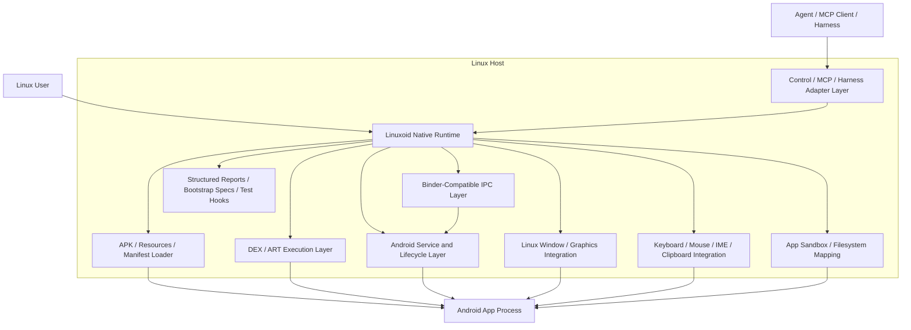
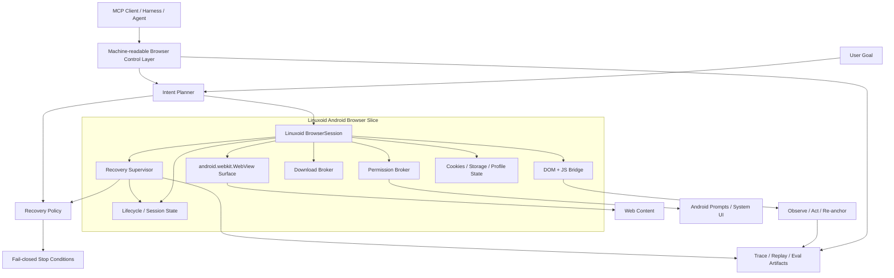

# Linuxoid

Linuxoid currently contains the first executable MVP scaffold for an Android-on-Linux compatibility project.

## Current Direction

- Core language: `C++20`
- Runtime strategy: backend-neutral attached Android targets on the path to a native Linux compatibility layer
- Agent integration strategy: stable MCP- and harness-friendly control surfaces, artifact layouts, and verification commands
- Browser strategy: researched and frozen until `P5`; the target remains a Linuxoid-owned Android WebView browser shell with a bounded self-healing recovery loop
- Current executable: `compatctl`

## Current Working Architecture

```mermaid
flowchart TB
  User["Linux User"] --> Desktop["Linux Desktop Entry or Shell Launcher"]
  Agent["Agent / MCP Client / Harness"] --> Compatctl
  Desktop --> Compatctl["Linuxoid compatctl"]

  subgraph Host["Linux Host"]
    Compatctl --> Status["Status and Checkpoint Engine"]
    Compatctl --> Loader["APK Loader and Manifest Assessor"]
    Compatctl --> NativePlanner["Native Spike Planner"]
    Compatctl --> NativeBootstrap["Native Activity Bootstrap"]
    Compatctl --> NativeLifecycle["Native Lifecycle and Service Shim"]
    Compatctl --> Preflight["Runtime Discovery and Preflight"]
    Compatctl --> Inspector["Package Metadata and Launcher Resolver"]
    Compatctl --> Desktopify["Desktop Artifact Generator"]
    Compatctl --> Verifier["Installed-Package Verifier and Matrix Verifier"]
    Compatctl --> ApkVerifier["APK-backed Host Verifier"]
    Compatctl --> Runtime["Runtime Bridge Layer"]
    Compatctl --> MachineSurface["Machine-readable Control and Artifact Surface"]
    Loader --> CompatRoot["Compat Root and Package Staging"]
    NativePlanner --> CompatRoot
    NativePlanner --> NativeBundle["Native Bundle Layout and Bootstrap Spec"]
    NativeBootstrap --> NativeBundle
    NativeBootstrap --> NativeLifecycle
    NativeLifecycle --> NativeStubRunner["Linuxoid-owned Native Entrypoint Stub"]
    MachineSurface --> Reports["Reports / Status / Bootstrap Specs"]
    Preflight --> Runtime
    Inspector --> Runtime
    Desktopify --> DesktopFiles[".desktop Files and Launcher Scripts"]
  end

  Runtime --> BackendContract["Installed-package Backend Contract"]
  Runtime --> AdbBridge["ADB Activity and IME Commands"]

  subgraph Backend["Current and Future Backends"]
    BackendContract --> WaydroidAdapter["Waydroid Adapter"]
    BackendContract --> AttachedAdb["Attached ADB Target"]
    BackendContract --> NativeStub["Native Linux Runtime Stub"]
    WaydroidAdapter --> WaydroidCLI["waydroid app and session commands"]
    WaydroidCLI --> Android["Android Userspace"]
    AttachedAdb --> Android
    AdbBridge --> Android
    Android --> InstalledApps["Installed Android Apps"]
  end

  Compatctl --> KeyboardFlow["APK-backed IME Provisioning Flow"]
  KeyboardFlow --> Loader
  KeyboardFlow --> Desktopify
  KeyboardFlow --> ApkVerifier
  KeyboardFlow --> Runtime
  Runtime --> KeyboardApp["FUTO Keyboard and F-Droid APK-backed Proofs"]

  Compatctl --> InstalledFlow["Installed-package Linux Launch Flow"]
  InstalledFlow --> Verifier
  Verifier --> DesktopFiles
  Verifier --> BackendContract
  InstalledApps --> ProvenApps["Calculator, Settings, and F-Droid"]
  NativeStubRunner --> NativeStub
  NativeBundle --> NativeProof["Calculator Native Spike Proof"]
  NativeLifecycle --> NativeLifecycleProof["Calculator Lifecycle Shim Proof"]
  NativeStubRunner --> NativeStubProof["Calculator Local Stub Proof"]
```



This diagram is the current working architecture and should stay in sync with the verified Linuxoid flow on GitHub.

## Architecture Constraints

- Keep Linuxoid control paths scriptable and machine-friendly so MCP clients, agent runtimes, and validation harnesses can drive them without reverse engineering human-only output.
- Preserve stable artifact locations for staged APKs, bootstrap manifests, reports, and launch scripts so harnesses can discover and validate state deterministically.
- Prefer backend-neutral commands and structured intermediate files over backend-specific ad hoc flows.
- Treat Waydroid, attached ADB, and future native execution as pluggable backends behind the same agent-usable control surface where possible.
- For browser-agent work, preserve user intent separately from selectors, page paths, or one-off recovery tactics so self-healing can retry safely without drifting scope.
- Browser recovery must stay bounded and fail-closed: idempotent fixes may auto-heal, but scope expansion, destructive actions, security prompts, and ambiguous targets must stop.

## Mermaid Update Rule

- Update the **Current Working Architecture** Mermaid graph in the same commit as every meaningful change to runtime flow, backend contracts, native execution slices, or verification surfaces.
- Update the **Target Architecture** Mermaid graph whenever the long-term no-runtime design changes.
- Keep the README diagrams GitHub-ready so the current state of Linuxoid is visible without opening source files first.

## Execution Plan

Linuxoid now treats the phased execution plan as the repo-facing source of truth for the direct-runtime push:

- Current state: scaffold `95/100`, execution `0/100`
- Current focus: `P0 Freeze & Triage`
- Critical path: `P1 NDK Execution Core -> P2 Window + Graphics`
- Browser work is frozen until `P5`

Plan document: [docs/phased-build-plan.md](/home/astra/codex/wine-for-android/docs/phased-build-plan.md)

## Target Architecture



This is the long-term goal state: run Android apps on Linux without depending on Waydroid, an emulator, or another external Android runtime.

## Self-Healing Browser Target Slice



This is the researched browser target slice, not a shipped Linuxoid feature yet. It is explicitly frozen until `P5` while Linuxoid focuses on native execution, Wayland graphics, DEX, and Binder. The recommended foundation remains a **Linuxoid-owned browser shell on the Android WebView API surface**, with the self-healing logic outside the page and the control surface kept MCP- and harness-friendly from day one.

## What Exists Today

- A C++ checkpoint engine with weighted runtime gates
- A phase-progress reporter with `0-100` loading output
- A package-layout planner for APK, app data, and OBB storage
- A decoded-manifest assessor for runtime and service requirements
- A real `load-apk` path that stages an APK into a compat root
- A `discover-runtime` path that enumerates current runtime targets for `attached-adb`, `waydroid`, and `native`
- A `preflight-runtime` path that checks backend availability, target selection, package visibility, and launch readiness before a generic installed-package launch, including attached-target launcher auto-resolution when the component is omitted
- An `inspect-package` path that reads attached-target package visibility, resolved launcher component, install path, version code, and version name from a live runtime target
- A generic `launch-activity` bridge for explicit Android component launches from Linux
- A generic `launch-package` bridge for installed-package launches across runtime backends, with `waydroid`, `attached-adb`, and `native` routing, and attached-target launcher fallback when callers omit a component
- An `adb-ime-status` runtime bridge for installed IME verification on a live Android target
- A `provision-ime` runtime bridge that installs, enables, sets default, and re-verifies an IME on a live Android target
- A `desktopify-apk` path that generates a Linux wrapper script and `.desktop` entry for a caller-selected Android component, and for IME apps it generates a provisioning launcher with explicit side effects
- A `desktopify-apk-auto` path that infers the launcher activity from the APK manifest and splits desktop-entry and launcher-script roots for cleaner host integration
- A `verify-apk-host-launch-auto` path that stages a local APK, generates Linux launcher artifacts for it, and verifies the generated launcher path against a live Android runtime
- A backend-neutral installed-package launcher-artifact seam that now emits `launch-package` wrappers instead of hard-coding Waydroid in the generated host script
- A `plan-native-spike` path that stages a local APK into a compat root, assesses whether it fits the first native app slice, writes a Linuxoid-owned bundle layout, and emits a bootstrap spec for future no-runtime execution
- A `bootstrap-native-spike` path that turns a native candidate into a Linuxoid-owned bootstrap manifest, environment script, entrypoint stub, and bootstrap report
- A `native-lifecycle-shim` path that consumes the bootstrap manifest, creates deterministic lifecycle session artifacts, and exposes a first Linuxoid-owned service registry
- A `native-execute-stub` path that runs the Linuxoid-owned native bootstrap entrypoint locally and reports the still-missing execution core honestly
- A `launch-waydroid-package` compatibility alias that still launches an already installed app through the Waydroid adapter without requiring an APK reinstall or a hardcoded ADB serial
- A `desktopify-waydroid-package` path that generates a Linux launcher and `.desktop` entry for an installed Waydroid app
- A generic `verify-package` path that proves direct Linux launch for an installed package by checking runtime launch, generated host-launch artifacts, and generated launcher execution across backend contracts
- A generic `verify-package-matrix` path that runs the installed-package verification loop across several apps and reports pass/fail per package without Waydroid-shaped command names
- A `verify-waydroid-package` path that proves direct Linux launch for an installed Waydroid app by checking the runtime launch, the generated host launcher artifacts, and the generated launcher execution
- A `verify-waydroid-matrix` path that runs the direct Linux verification loop across several installed Waydroid apps and reports pass/fail per package
- A live Waydroid-backed proof that a Linuxoid-generated launcher can install the keyboard APK, enable it, set it as default, and return `Ready for typing: yes` from Linux
- A live Waydroid-backed proof that the keyboard APK now verifies end to end from its local file path through the Linuxoid-generated launcher flow
- A live Waydroid-backed proof that the local F-Droid APK now verifies end to end from its file path through the Linuxoid-generated launcher flow
- A live Waydroid-backed proof that a Linuxoid-generated launcher can open `com.android.calculator2` from Linux through the new installed-package path
- A live Waydroid-backed proof that the new generic `verify-package` command passes for `com.android.calculator2`
- A live Waydroid-backed proof that the new generic `verify-package-matrix` command passes `3/3` for `com.android.calculator2`, `com.android.settings`, and `org.fdroid.fdroid`
- A live Waydroid-backed mini-matrix that verifies direct Linux launch for `com.android.calculator2`, `com.android.settings`, and `org.fdroid.fdroid`
- A live attached-ADB proof that `inspect-package` resolves `com.android.settings/.Settings` and reads its install path plus version metadata from the target itself
- A live attached-ADB proof that `launch-package attached-adb com.android.settings 192.168.240.112:5555` succeeds without an explicit component
- A live attached-ADB proof that `verify-package` now passes for `com.android.settings` without an explicit component
- A live attached-ADB proof that `verify-package-matrix` now passes `3/3` for `com.android.settings`, `com.android.calculator2`, and `org.fdroid.fdroid` without explicit components
- A live local-APK proof that `plan-native-spike` now accepts Calculator as a native candidate, writes a native bundle plan, and emits a bootstrap spec with no blockers
- A live local-Linux proof that `native-lifecycle-shim` creates Calculator session artifacts, reaches `Lifecycle Handoff Ready: yes`, and exposes the first Linuxoid-owned service bindings
- A live local-Linux proof that `bootstrap-native-spike` emits Calculator bootstrap artifacts and that the generated `launch-native-activity.sh` stub runs locally with `Execution Engine Ready: no` and exit code `2`
- A local test suite that verifies the first scaffold behavior

## Current External Dependencies

Linuxoid does **not** yet run Android apps natively on Linux by itself. The current project still relies on these external dependencies:

- `CMake 4.0+`
- a `C++20` compiler such as `g++` or `clang++`
- `adb` for runtime attachment, activity launch, IME control, and status checks
- `timeout` from GNU coreutils for bounded attached-ADB discovery and preflight checks
- `apktool` for APK decode and manifest/resource staging during `load-apk` flows
- a live Android runtime target for execution paths:
  - `Waydroid` for the currently verified installed-package Linux launch flow
  - or an attached ADB target for the generic `attached-adb` backend contract
- a Linux desktop environment that supports `.desktop` launchers and shell scripts for host integration

### Dependency Notes

- The new `launch-package` core path is backend-neutral, but **native Linux execution is still not implemented**.
- The new `plan-native-spike` core path materializes Linuxoid-owned native launch assets, but **those assets are not executing Android bytecode on Linux yet**.
- The new `bootstrap-native-spike` and `native-execute-stub` paths prove Linuxoid can own the local bootstrap surface, but **the entrypoint is still a stub until lifecycle, DEX, and graphics integration land**.
- The new `native-lifecycle-shim` path proves Linuxoid can own lifecycle/session handoff and service binding artifacts locally, but **it still stops before real app-code execution**.
- The current live proofs on GitHub are still **runtime-backed**: Waydroid handles the installed-package Linux launch path, and `attached-adb` remains a transition backend plus regression oracle.
- `attached-adb` is now part of the core contract with target-side launcher and metadata lookup, but it is still not the final goal.
- Waydroid and `attached-adb` stay in scope as regression oracles through `P0-P4`, but they are not acceptable end-state runtimes for Linuxoid.
- Future native slices should preserve **MCP and harness compatibility** by keeping commands backend-neutral, outputs inspectable, and artifact paths deterministic for agent workflows.
- The self-healing browser track should start from **Android WebView + Linuxoid BrowserSession**, not a full Chromium browser shell or `Chrome.apk` port, and it should remain frozen until `P5`.

## What To Do Next

These are the next five highest-value moves from the current state if the goal is to run Android apps directly on Linux without depending on Waydroid or any other external Android runtime:

1. Audit `native-execute-stub` on Calculator and record the exact stop point.
   Linuxoid needs one hard execution baseline before changing anything else.

2. Map every current `not implemented` or stubbed native-runtime exit.
   The point of `P0` is to turn today’s scattered stops into an ordered queue for `P1+`.

3. Replace the current native stub with the first `dlopen()` and `ANativeActivity_onCreate` path for the Calculator-like app class.
   The first real win is not Java, Binder, or browser work. It is a Linux process that loads Android native code and stays alive.

4. Add the smallest viable fake `ANativeActivity`, `JavaVM`, `JNIEnv`, `AAssetManager`, and `ALooper` surfaces needed to keep that process alive for five seconds.
   That is the real `P1` gate.

5. Move straight into Wayland and EGL once the process stays up.
   The next meaningful proof after `P1` is a real pixel in a Linux window, not another scaffold layer.

For every step above, keep the interfaces **MCP- and harness-compatible**:
- machine-readable outputs should remain stable
- intermediate artifacts should stay discoverable
- verification commands should stay composable in agent workflows

## Browser Track Status

The self-healing browser track is researched but frozen until `P5 Audio + Network + Browser`.

What stays frozen until then:

- BrowserSession implementation
- Self-healing recovery policy implementation
- DOM and JS bridge work
- Permission, download, and prompt broker work

Why the freeze exists:

- Linuxoid still has `execution 0/100` on the native path.
- `P1 -> P2` is the real blocker for the whole project.
- Browser work only makes sense after Linuxoid can already host Android UI and app code directly.

The browser target architecture is still useful as a design reference and stays documented here:

Detailed architecture note: [docs/browser-self-healing-architecture.md](/home/astra/codex/wine-for-android/docs/browser-self-healing-architecture.md)

## Build

```bash
cmake -S . -B build
cmake --build build
```

## Verify

```bash
ctest --test-dir build --output-on-failure
./build/compatctl status
./build/compatctl foundation
./build/compatctl layout com.example.demo alpha01 42 /var/lib/wfa
./build/compatctl assess-manifest /path/to/decoded/AndroidManifest.xml
./build/compatctl load-apk /path/to/app.apk /tmp/wfa-load
./build/compatctl discover-runtime attached-adb
./build/compatctl preflight-runtime attached-adb
./build/compatctl inspect-package attached-adb 192.168.240.112:5555 com.android.settings
./build/compatctl launch-activity emulator-5590 org.example.app/.SettingsActivity
./build/compatctl launch-package waydroid com.android.calculator2
./build/compatctl launch-package attached-adb com.android.settings 192.168.240.112:5555
./build/compatctl launch-package native com.example.demo
./build/compatctl verify-package waydroid com.android.calculator2 - - /tmp/linuxoid-generic-applications /tmp/linuxoid-generic-launchers
./build/compatctl verify-package-matrix waydroid /tmp/linuxoid-generic-matrix - com.android.calculator2 com.android.settings org.fdroid.fdroid
./build/compatctl verify-package attached-adb com.android.settings 192.168.240.112:5555 - /tmp/linuxoid-attached-applications /tmp/linuxoid-attached-launchers
./build/compatctl verify-package-matrix attached-adb /tmp/linuxoid-attached-matrix 192.168.240.112:5555 com.android.settings com.android.calculator2 org.fdroid.fdroid
./build/compatctl plan-native-spike /path/to/app.apk /tmp/linuxoid-native-compat /tmp/linuxoid-native-spike
./build/compatctl bootstrap-native-spike /path/to/app.apk /tmp/linuxoid-native-compat /tmp/linuxoid-native-spike
./build/compatctl native-lifecycle-shim /tmp/linuxoid-native-spike/packages/com.example.app/vc1/bootstrap/activity-bootstrap.json
./build/compatctl native-execute-stub com.example.app com.example.app/.MainActivity /tmp/linuxoid-native-spike/packages/com.example.app/vc1/bundle/base.apk /tmp/linuxoid-native-spike/packages/com.example.app/vc1/sandbox /tmp/linuxoid-native-spike/packages/com.example.app/vc1/dex-cache /tmp/linuxoid-native-spike/packages/com.example.app/vc1/resources /tmp/linuxoid-native-spike/packages/com.example.app/vc1/lib /tmp/linuxoid-native-spike/packages/com.example.app/vc1/bootstrap/activity-bootstrap.json
./build/compatctl verify-apk-host-launch-auto emulator-5590 /path/to/app.apk /tmp/linuxoid-apk-verify /tmp/linuxoid-apk-applications /tmp/linuxoid-apk-launchers
./build/compatctl launch-waydroid-package com.android.calculator2
./build/compatctl verify-waydroid-package com.android.calculator2 /tmp/linuxoid-applications /tmp/linuxoid-launchers
./build/compatctl verify-waydroid-matrix /tmp/linuxoid-matrix com.android.calculator2 com.android.settings org.fdroid.fdroid
./build/compatctl adb-ime-status emulator-5590 org.example.app org.example.app/.ImeService
./build/compatctl adb-ime-status emulator-5590 org.example.app org.example.app/.ImeService org.example.app/.SettingsActivity
./build/compatctl provision-ime emulator-5590 /path/to/app.apk org.example.app org.example.app/.ImeService org.example.app/.SettingsActivity
./build/compatctl desktopify-apk emulator-5590 /path/to/app.apk org.example.app/.SettingsActivity /tmp/wfa-load /tmp/wfa-desktop
./build/compatctl desktopify-apk-auto emulator-5590 /path/to/app.apk /tmp/wfa-load /tmp/linuxoid-applications /tmp/linuxoid-launchers
./build/compatctl desktopify-waydroid-package com.android.calculator2 /tmp/linuxoid-applications /tmp/linuxoid-launchers
```

## Current Progress

- Phase loading: `95/100`
- Runtime checkpoint gates: `70/100`

These values are generated by the code, not written by hand.
