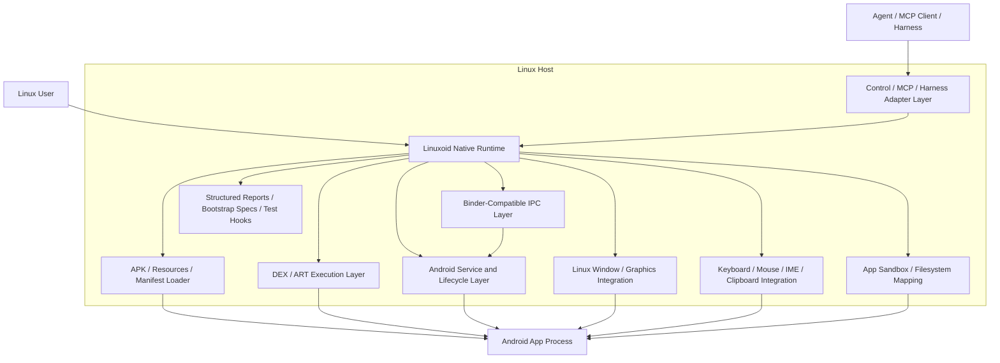
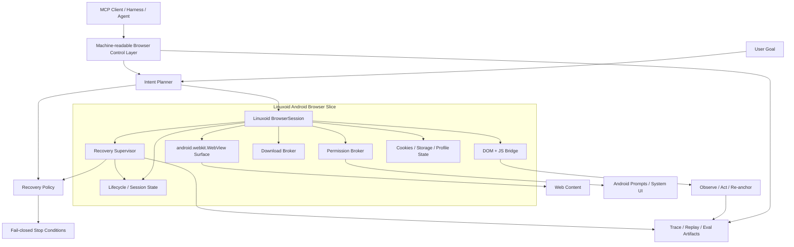

# Linuxoid

Linuxoid currently contains the first executable MVP scaffold for an Android-on-Linux compatibility project.

## Current Direction

- Core language: `C++20`
- Runtime strategy: backend-neutral attached Android targets on the path to a native Linux compatibility layer
- Product target: a Self-Healing Android Device runtime on Linux; browser-specific work remains a downstream track, not the primary target
- Agent integration strategy: stable MCP- and harness-friendly control surfaces, artifact layouts, and verification commands
- Browser strategy: researched and frozen until `P5`; the target remains a Linuxoid-owned Android WebView browser shell with a bounded self-healing recovery loop
- Current executable: `compatctl`

## Current Working Architecture

```mermaid
flowchart TB
  User["Linux User"] --> Desktop["Linux Desktop Entry or Shell Launcher"]
  Agent["Agent / MCP Client / Harness"] --> Compatctl
  Desktop --> Compatctl["Linuxoid compatctl"]

  subgraph Host["Linux Host"]
    Compatctl --> Status["Status and Checkpoint Engine"]
    Compatctl --> Loader["APK Loader and Manifest Assessor"]
    Compatctl --> NativeResources["APK Resource and Asset Readiness Bridge"]
    Compatctl --> NativePlanner["Native Spike Planner"]
    Compatctl --> NativeBootstrap["Native Activity Bootstrap"]
    Compatctl --> NativeExecute["P1 Native Execute Bootstrap"]
    Compatctl --> NativeLifecycle["Native Lifecycle and Service Shim"]
    Compatctl --> NativeRunner["P1 Native Execution Runner"]
    Compatctl --> NativeSurface["P2.1 Native Window Surface Fixture"]
    Compatctl --> NativeCallbacks["P2.2 Native Window Callback Fixture"]
    Compatctl --> NativeWayland["P2.1 Real Wayland Surface Fixture"]
    Compatctl --> NativeEgl["P2.2 EGL Smoke Fixture"]
    Compatctl --> NativeBridge["P2.3 ANativeWindow Bridge Fixture"]
    Compatctl --> NativeInput["P2.4 Focused Input Queue Fixture"]
    Compatctl --> NativeBinder["P4.1 Binder-shaped Service Manager Fixture"]
    Compatctl --> NativeArt["P3 ART Classloader Prep Fixture"]
    Compatctl --> NativeArtResolve["P3 Offline DEX Class Resolution Fixture"]
    Compatctl --> NativeArtRuntime["P3 Host ART Runtime Smoke Fixture"]
    Compatctl --> NativeArtBootstrap["P3 Activity Bootstrap Fixture"]
    Compatctl --> NativeArtBootstrapExec["P3 Bootstrap Execution Fixture"]
    Compatctl --> RuntimeHealth["Self-Healing Runtime Health Fixture"]
    Compatctl --> RuntimeRecovery["Self-Healing Runtime Recovery Plan Fixture"]
    Compatctl --> RuntimeDiagnostic["Self-Healing Runtime Diagnostic Replay Fixture"]
    Compatctl --> Preflight["Runtime Discovery and Preflight"]
    Compatctl --> Inspector["Package Metadata and Launcher Resolver"]
    Compatctl --> Desktopify["Desktop Artifact Generator"]
    Compatctl --> Verifier["Installed-Package Verifier and Matrix Verifier"]
    Compatctl --> ApkVerifier["APK-backed Host Verifier"]
    Compatctl --> Runtime["Runtime Bridge Layer"]
    Compatctl --> MachineSurface["Machine-readable Control and Artifact Surface"]
    Loader --> CompatRoot["Compat Root and Package Staging"]
    NativeResources --> CompatRoot
    NativePlanner --> CompatRoot
    NativePlanner --> NativeBundle["Native Bundle Layout / ABI Lib Staging / Bootstrap Spec"]
    NativeBootstrap --> NativeBundle
    NativeBootstrap --> NativeExecute
    NativeExecute --> NativeLifecycle
    NativeExecute --> NativeRunner
    NativeSurface --> NativeRunner
    NativeCallbacks --> NativeSurface
    NativeWayland --> NativeSurface
    NativeEgl --> NativeWayland
    NativeBridge --> NativeSurface
    NativeBridge --> NativeWayland
    NativeBridge --> NativeEgl
    NativeInput --> NativeBridge
    NativeBinder --> NativeLifecycle
    NativeArt --> NativeArtResolve
    NativeArtResolve --> NativeArtRuntime
    NativeArtRuntime --> NativeArtBootstrap
    NativeArtBootstrap --> NativeArtBootstrapExec
    NativeBinder --> NativeArtBootstrap
    NativeLifecycle --> NativeArtBootstrap
    NativeArtBootstrapExec --> RuntimeHealth
    RuntimeHealth --> RuntimeDiagnostic
    RuntimeRecovery --> RuntimeDiagnostic
    NativeArt --> RuntimeDiagnostic
    NativeArtResolve --> RuntimeDiagnostic
    NativeArtRuntime --> RuntimeDiagnostic
    NativeRunner --> NativeStubs["JNI Stub / APK-backed Asset Bridge / Looper Stub / Signal Handler"]
    NativeSurface --> NativeMarker["Headless First-pixel Marker"]
    NativeCallbacks --> NativeCallbackJournal["Window Callback Journal"]
    NativeWayland --> NativeWaylandArtifact["surface-metadata.json"]
    NativeEgl --> NativeEglArtifact["egl-metadata.json"]
    NativeBridge --> NativeBridgeArtifact["native-window-bridge-metadata.json / events.jsonl"]
    NativeInput --> NativeInputArtifact["native-input-queue-metadata.json / events.jsonl"]
    NativeBinder --> NativeBinderArtifact["binder/service-manager.json / lookups / transactions"]
    NativeArt --> NativeArtArtifact["art/classloader-plan.json / dex-inventory.json / trace.jsonl"]
    NativeArtResolve --> NativeArtResolveArtifact["art/class-resolution-map.json / result.json / trace.jsonl"]
    NativeArtRuntime --> NativeArtRuntimeArtifact["art/runtime-smoke-result.json / invocation-plan.json / invocation.log / trace.jsonl"]
    NativeArtBootstrap --> NativeArtBootstrapArtifact["art/activity-bootstrap-plan.json / result.json / trace.jsonl"]
    NativeArtBootstrapExec --> NativeArtBootstrapExecArtifact["art/bootstrap-execution-plan.json / result.json / trace.jsonl / context.json / runner.sh / runner-state.json / phase logs"]
    RuntimeHealth --> RuntimeHealthArtifact["health/runtime-health.json / trace.jsonl / replay.json / diagnostic-replay.json"]
    RuntimeRecovery --> RuntimeRecoveryArtifact["health/runtime-recovery-plan.json / runtime-recovery-actions.jsonl"]
    RuntimeDiagnostic --> RuntimeDiagnosticArtifact["health/runtime-diagnostic-trace-index.json / runtime-diagnostic-events.jsonl / runtime-diagnostic-replay.json"]
    NativeResources --> NativeResourceArtifact["inspect-apk-resources JSON / staged asset roots"]
    NativeBinder --> NativeBinderTransportArtifact["binder/transport-messages.jsonl"]
    NativeLifecycle --> NativeStubRunner["Linuxoid-owned Native Entrypoint Stub"]
    NativeExecute --> NativeSession["Truthful Session / Runner Logs / JSON Reports"]
    MachineSurface --> Reports["Reports / Status / Bootstrap Specs"]
    Preflight --> Runtime
    Inspector --> Runtime
    Desktopify --> DesktopFiles[".desktop Files and Launcher Scripts"]
  end

  Runtime --> BackendContract["Installed-package Backend Contract"]
  Runtime --> AdbBridge["ADB Activity and IME Commands"]

  subgraph Backend["Current and Future Backends"]
    BackendContract --> WaydroidAdapter["Waydroid Adapter"]
    BackendContract --> AttachedAdb["Attached ADB Target"]
    BackendContract --> NativeStub["Native Linux Runtime Stub"]
    WaydroidAdapter --> WaydroidCLI["waydroid app and session commands"]
    WaydroidCLI --> Android["Android Userspace"]
    AttachedAdb --> Android
    AdbBridge --> Android
    Android --> InstalledApps["Installed Android Apps"]
  end

  Compatctl --> KeyboardFlow["APK-backed IME Provisioning Flow"]
  KeyboardFlow --> Loader
  KeyboardFlow --> Desktopify
  KeyboardFlow --> ApkVerifier
  KeyboardFlow --> Runtime
  Runtime --> KeyboardApp["FUTO Keyboard and F-Droid APK-backed Proofs"]

  Compatctl --> InstalledFlow["Installed-package Linux Launch Flow"]
  InstalledFlow --> Verifier
  Verifier --> DesktopFiles
  Verifier --> BackendContract
  InstalledApps --> ProvenApps["Calculator, Settings, and F-Droid"]
  NativeStubRunner --> NativeStub
  NativeBundle --> NativeProof["Calculator Native Spike Proof"]
  NativeLifecycle --> NativeLifecycleProof["Calculator Lifecycle Shim Proof"]
  NativeRunner --> NativeFixtureProof["Fixture Native Activity 5s Proof"]
  NativeRunner --> NativeOracleProof["Dex-only Calculator Missing-lib Oracle"]
  NativeSurface --> NativePixelProof["Headless First-pixel Marker Proof"]
  NativeCallbacks --> NativeCallbackProof["Headless Window Callback Proof"]
  NativeWayland --> NativeWaylandProof["Real wl_display / wl_surface Proof"]
  NativeEgl --> NativeEglProof["Real EGL Context / Pbuffer Proof"]
  NativeBridge --> NativeBridgeProof["ANativeWindow Bridge Contract Proof"]
  NativeInput --> NativeInputProof["Focused Input Queue Contract Proof"]
  NativeBinder --> NativeBinderProof["Binder-shaped Local Service Manager Proof"]
  NativeArt --> NativeArtProof["DEX Inventory / ART Classpath Prep Proof"]
  NativeArtResolve --> NativeArtResolveProof["Offline Manifest-target DEX Resolution Proof"]
  NativeArtRuntime --> NativeArtRuntimeProof["Host ART Invocation Smoke Proof"]
  NativeArtBootstrap --> NativeArtBootstrapProof["Application / Activity Bootstrap Attempt Proof"]
  NativeArtBootstrapExec --> NativeArtBootstrapExecProof["Bootstrap Execution Attempt Proof"]
  RuntimeHealth --> RuntimeHealthProof["Self-Healing Runtime Health / Replay Proof"]
  RuntimeRecovery --> RuntimeRecoveryProof["Deterministic Runtime Recovery Plan Proof"]
  NativeResources --> NativeResourceProof["APK Manifest / Asset Readiness Proof"]
  NativeStubRunner --> NativeStubProof["Generated Entrypoint Now Calls Native Runner"]
```



This diagram is the current working architecture and should stay in sync with the verified Linuxoid flow on GitHub.

## Architecture Constraints

- Keep Linuxoid control paths scriptable and machine-friendly so MCP clients, agent runtimes, and validation harnesses can drive them without reverse engineering human-only output.
- Preserve stable artifact locations for staged APKs, bootstrap manifests, reports, and launch scripts so harnesses can discover and validate state deterministically.
- Prefer backend-neutral commands and structured intermediate files over backend-specific ad hoc flows.
- Treat Waydroid, attached ADB, and future native execution as pluggable backends behind the same agent-usable control surface where possible.
- For browser-agent work, preserve user intent separately from selectors, page paths, or one-off recovery tactics so self-healing can retry safely without drifting scope.
- Browser recovery must stay bounded and fail-closed: idempotent fixes may auto-heal, but scope expansion, destructive actions, security prompts, and ambiguous targets must stop.

## Mermaid Update Rule

- Update the **Current Working Architecture** Mermaid graph in the same commit as every meaningful change to runtime flow, backend contracts, native execution slices, or verification surfaces.
- Update the **Target Architecture** Mermaid graph whenever the long-term no-runtime design changes.
- Keep the README diagrams GitHub-ready so the current state of Linuxoid is visible without opening source files first.

## Execution Plan

Linuxoid now treats the phased execution plan as the repo-facing source of truth for the direct-runtime push:

- Current state: scaffold `96/100`, execution `98/100`
- Current focus: `P1 NDK Execution Core -> P2 Window + Graphics`
- Critical path: `P1 NDK Execution Core -> P2 Window + Graphics`
- Browser work is frozen until `P5`

Plan document: [docs/phased-build-plan.md](/home/astra/codex/wine-for-android/docs/phased-build-plan.md)
Detailed gap research: [docs/15-track-research-wave-2026-05-16.md](/home/astra/codex/wine-for-android/docs/15-track-research-wave-2026-05-16.md)

## What Self-Healing Means Now

Today, **self-healing** in Linuxoid means:

- Linuxoid can expose the native direct-run path through stable public command contracts before full Android execution exists:
  - `native-runtime-health-fixture`
  - `native-runtime-recovery-plan`
  - `native-runtime-health-replay`
  - `native-runtime-diagnostic-replay`
  - `native-runtime-diagnostic-fixture`
- Linuxoid can classify native-runtime state into deterministic subsystem records instead of treating failures as opaque crashes.
- Linuxoid can select bounded recovery actions for known failure classes such as missing bundle artifacts, failed native loading, unavailable display surfaces, failed local service lookup, and pending ART/classloader work.
- Linuxoid now also tracks pending post-class-resolution activity bootstrap as its own bounded runtime state instead of folding it into generic classloader readiness.
- Those recovery actions now carry explicit deterministic metadata for harnesses:
  - stable `action_rank`
  - bounded `retry_budget`
  - stable `recovery_scope`
- Linuxoid now also exposes direct summary fields so callers do not need to re-derive the runtime state from raw records:
  - `dependency_blocked`
  - `failing_subsystem_count`
  - `recovery_actions_selected`
  - `failing_subsystems`
- Linuxoid can persist those decisions into stable artifacts for agents, harnesses, and replay tooling:
  - `runtime-health.json`
  - `runtime-health-trace.jsonl`
  - `runtime-recovery-plan.json`
  - `runtime-recovery-actions.jsonl`
  - `runtime-diagnostic-trace-index.json`
  - `runtime-diagnostic-events.jsonl`
  - `runtime-diagnostic-replay.json`
- Linuxoid can now also carry class-resolution evidence forward into a deterministic post-resolution activity-bootstrap seam:
  - `native-art-activity-bootstrap-fixture`
  - `art/activity-bootstrap-plan.json`
  - `art/activity-bootstrap-trace.jsonl`
  - `art/activity-bootstrap-result.json`
- Linuxoid now upgrades that seam from activity-only planning into a host-side application-plus-launcher bootstrap attempt contract:
  - normalized manifest application class when present
  - explicit application bootstrap probe event
  - explicit launcher-activity bootstrap probe event
  - separate attempt and success state for each probe
- Linuxoid now also treats activity bootstrap planning as a first-class self-healing subsystem:
  - `activity_bootstrap_readiness`
  - ready when the launcher/bootstrap plan is fully materialized
  - merged replay coverage through `art/activity-bootstrap-trace.jsonl`
- Linuxoid now also upgrades that activity seam into a deterministic bootstrap-execution contract:
  - `native-art-bootstrap-execution-fixture`
  - `art/bootstrap-execution-plan.json`
  - `art/bootstrap-execution-trace.jsonl`
  - `art/bootstrap-execution-result.json`
  - `art/bootstrap-execution-context.json`
  - `art/bootstrap-execution-runner.sh`
  - `art/bootstrap-execution-runner-state.json`
  - `art/bootstrap-execution-application.log`
  - `art/bootstrap-execution-activity.log`
- Linuxoid now also treats bootstrap execution as its own bounded self-healing subsystem:
  - `bootstrap_execution_readiness`
  - `attempt_host_bootstrap_execution`
- Linuxoid now executes that seam through the generated runner script when a safe host runtime is available, and it preserves raw runner plus per-phase exit codes for replay and diagnosis.
- Linuxoid now also supports a Linuxoid-owned ART probe override for deterministic fixture runs, so the runtime-smoke and bootstrap-execution seams can be exercised end to end even on hosts that do not ship ART locally.
- Linuxoid runtime health now recognizes that deeper success path too: when the ART-style class-resolution seam and supervised bootstrap-execution seam both succeed, `dex_classloader_readiness` and `bootstrap_execution_readiness` now converge to `ready` instead of staying stuck in a generic pending state.
- Linuxoid now also distinguishes **DEX-only** bundles from broken native loading: when an APK declares no native libraries at all, `native_loading` resolves to `not_required` instead of falsely reporting a blocked native-loader failure.
- Linuxoid now also exposes a real local `native` runtime bridge for staged package discovery, staged metadata lookup, staged-package preflight, and bootstrap-execution handoff, so self-healing can reason about a Linuxoid-owned local target instead of only attached Android runtimes.
- Linuxoid now also threads that same staged-package preflight into the backend-neutral verification surface: `verify-package` and `verify-package-matrix` now report runtime-target selection plus package visibility plus component readiness before launch, and the local `native` backend uses that same contract instead of a launch-only shortcut.
- Linuxoid now also separates **fixture override success** from **real host launch success** on the native launch path: `launch-package native` records override-backed ART/bootstrap success in artifacts, but it only classifies that as a successful app launch when `LINUXOID_NATIVE_ALLOW_RUNTIME_OVERRIDE=1` is set explicitly.
- Linuxoid can replay and merge those traces later without rerunning the full UI path.
- Linuxoid can now fingerprint each trace source and record first/last event types so failures can be compared offline across runs.
- Linuxoid now reuses one opened APK archive plus the already-staged bundle manifest while building those runtime records, so live health and replay commands stay fast enough to rerun on real staged bundles without falling back to repeated full-archive scans and repeated `apktool` decode work.
- Linuxoid now merges the activity-bootstrap trace into that replay bundle, so launcher targeting and Binder-readiness failures stay diagnosable offline too.
- Linuxoid refuses false success when a critical dependency is missing. A missing native library payload or missing ART runtime still leaves the runtime in `recovery_needed`, not `ready`.
- Linuxoid also stays backward-compatible with older staged bootstrap manifests that predate the native-library summary fields, so replay and health commands keep working across already-materialized bundles.
- Linuxoid now has regression coverage that checks this both structurally and behaviorally:
  - health classification stays stable
  - recovery decision selection stays deterministic
  - repeated command JSON stays stable
  - missing dependencies do not flip the runtime into false success

This is **observability and bounded recovery planning**, not autonomous app repair or full Android execution.

## What Still Blocks Full Android App Execution

Linuxoid is still **not** at “run Android apps directly on Linux end to end” yet. The main remaining blockers are:

1. **Real ART / DEX execution**
   - host-side `PathClassLoader` or equivalent class resolution still needs to move from planning/smoke to actual execution
   - application code is not yet running through a real ART-owned path by default; the current override-backed fixture path is a Linuxoid test seam, not proof of embedded ART execution on this host
   - the current supervised bootstrap-execution seam is a truthful launch-attempt contract, not yet a successful real host ART startup for a staged foreground app

2. **Android framework and services**
   - the Binder-shaped local manager is still a Linuxoid-owned seam, not full Android Binder semantics
   - `ActivityManager`, `PackageManager`, and related behavior are still partial stubs

3. **Graphics binding**
   - Wayland and EGL proofs exist separately
   - the real bound path from Android-style rendering into a live compositor-backed surface is still pending

4. **Input and text**
   - focused pointer/key injection is verified
   - full IME, text composition, clipboard fidelity, and richer input routing are still pending

5. **Android resources**
   - manifest and asset readiness are in place
   - full `resources.arsc`, binary XML, themed resource lookup, and framework-style resource semantics are still pending

6. **Real app bootstrap**
   - Linuxoid can now stage, classify, preflight, diagnose, replay, and materialize a deterministic application-plus-activity bootstrap planning seam plus a separate execution seam
   - it still needs the first successful host-side Android class execution and application or activity bootstrap on the native path for a real staged candidate app, not only override-backed fixture success

## Target Architecture



This is the long-term goal state: run Android apps on Linux without depending on Waydroid, an emulator, or another external Android runtime.

## Self-Healing Browser Target Slice



This is the researched browser target slice, not a shipped Linuxoid feature yet. It is explicitly frozen until `P5` while Linuxoid focuses on native execution, Wayland graphics, DEX, and Binder. The recommended foundation remains a **Linuxoid-owned browser shell on the Android WebView API surface**, with the self-healing logic outside the page and the control surface kept MCP- and harness-friendly from day one.

## What Exists Today

- A C++ checkpoint engine with weighted runtime gates
- A phase-progress reporter with `0-100` loading output
- A package-layout planner for APK, app data, and OBB storage
- A decoded-manifest assessor for runtime and service requirements
- A real `load-apk` path that stages an APK into a compat root
- A `discover-runtime` path that enumerates current runtime targets for `attached-adb`, `waydroid`, and `native`
- A `preflight-runtime` path that checks backend availability, target selection, package visibility, and launch readiness before a generic installed-package launch, including attached-target launcher auto-resolution when the component is omitted and Linuxoid-owned staged-package lookup for the `native` backend
- An `inspect-package` path that reads attached-target package visibility, resolved launcher component, install path, version code, and version name from a live runtime target, and now reads the same staged metadata from a Linuxoid compat root for the `native` backend
- A generic `launch-activity` bridge for explicit Android component launches from Linux
- A generic `launch-package` bridge for installed-package launches across runtime backends, with `waydroid`, `attached-adb`, and `native` routing, and attached-target launcher fallback when callers omit a component
- The `native` branch of that `launch-package` bridge now reuses staged package metadata plus the bootstrap-execution seam, and it reports non-candidate packages honestly instead of falling back to a hard `not implemented` stub
- An `adb-ime-status` runtime bridge for installed IME verification on a live Android target
- A `provision-ime` runtime bridge that installs, enables, sets default, and re-verifies an IME on a live Android target
- A `desktopify-apk` path that generates a Linux wrapper script and `.desktop` entry for a caller-selected Android component, and for IME apps it generates a provisioning launcher with explicit side effects
- A `desktopify-apk-auto` path that infers the launcher activity from the APK manifest and splits desktop-entry and launcher-script roots for cleaner host integration
- A `verify-apk-host-launch-auto` path that stages a local APK, generates Linux launcher artifacts for it, and verifies the generated launcher path against a live Android runtime
- A backend-neutral installed-package launcher-artifact seam that now emits `launch-package` wrappers instead of hard-coding Waydroid in the generated host script
- A `plan-native-spike` path that stages a local APK into a compat root, assesses whether it fits the first native app slice, writes a Linuxoid-owned bundle layout, stages host-ABI native libraries into the deterministic `lib` root, copies extracted `assets/` and `res/` content into stable resource roots, and emits a bootstrap spec for future no-runtime execution
- A `bootstrap-native-spike` path that turns a native candidate into a Linuxoid-owned bootstrap manifest, environment script, entrypoint stub, and bootstrap report
- A `native-lifecycle-shim` path that consumes the bootstrap manifest, creates deterministic lifecycle session artifacts, and now keeps pre-launch activity/process state truthful instead of claiming `RESUMED` before a process exists
- A `native-execute-stub <bootstrap-manifest>` path that now owns the public Linuxoid native bootstrap surface, forks and `execve`s a controlled child runner, sets deterministic cwd plus Linuxoid-only environment variables, closes inherited file descriptors, and emits structured JSON for harnesses and replay tooling
- A `native-process-bootstrap` compatibility alias that still resolves the same parent bootstrap flow for older local automation while the public entrypoint stays on `native-execute-stub`
- A `native-execute-stub <package> ...` runner path that now scans a bundle library root, loads `.so` files in deterministic order, calls `JNI_OnLoad` when present, resolves `ANativeActivity_onCreate`, installs crash logging, and keeps the process alive to the first five-second gate
- A `native-first-pixel-fixture <session-root> [width] [height] [format]` path that creates a headless `ANativeWindow`-shaped surface with explicit metadata and writes a deterministic first-pixel marker instead of pretending a real compositor window already exists
- A `native-window-callback-fixture <session-root> [width] [height] [format]` path that dispatches Linuxoid-owned `window_created`, `window_changed`, and `window_destroyed` activity callbacks and writes a deterministic callback journal artifact for the future real graphics path
- A `native-wayland-surface-fixture <session-root> [width] [height]` path that uses the system `wayland-client` library when available to connect to a real `wl_display`, bind `wl_compositor`, create a `wl_surface`, and write a stable `surface-metadata.json` artifact, while still falling back honestly when Wayland is unavailable
- A `native-egl-smoke-fixture <session-root> [width] [height]` path that uses the system `libEGL` when available to initialize a real EGL display, choose a config, create an OpenGL ES context plus pbuffer surface, and write a stable `egl-metadata.json` artifact, while still falling back honestly when EGL is unavailable
- A `native-window-bridge-fixture <session-root> [width] [height] [format]` path that exposes a minimal `ANativeWindow` bridge contract with width, height, format, stride, deterministic buffer-geometry updates, stable metadata/event artifacts, and honest probe-only versus headless-fallback reporting
- A `native-input-queue-fixture <session-root> [width] [height] [format]` path that injects a deterministic focus-acquire plus pointer/key event sequence against the bridge contract, writes stable metadata plus JSONL event artifacts, and reports honest probe-only versus headless-fallback backing without claiming full IME or text composition support
- A `native-service-manager-fixture <bootstrap-manifest>` path that emits a local Binder-shaped service-manager contract with deterministic service registration, lookup, and transaction artifacts for Linuxoid-owned `package_manager` and `activity_manager` stubs
- A `native-art-classloader-fixture <bootstrap-manifest>` path that inventories staged APK dex entries, normalizes manifest target classes into deterministic descriptors, writes classpath-plan artifacts, and reports missing host ART honestly without pretending real class execution exists yet
- A `native-art-class-resolution-fixture <bootstrap-manifest>` path that resolves manifest-target descriptors from real staged DEX contents, writes deterministic resolution-map artifacts, and records honest unresolved targets without pretending ART has executed anything yet
- A `native-art-runtime-smoke <bootstrap-manifest>` path that reuses the classloader plan plus offline class-resolution result, selects a deterministic manifest-derived class target, writes deterministic invocation-plan plus runtime-log plus trace artifacts, and attempts a real host-side `dalvikvm -cp <apk> <class>` class-resolution probe only when a safe local `dalvikvm` surface is available
- A `native-runtime-health-fixture <bootstrap-manifest> [scenario]` path that records staged-runtime health, selects deterministic recovery actions, and writes replayable JSON plus JSONL artifacts for the Self-Healing Android Device skeleton
- A `native-runtime-recovery-plan <bootstrap-manifest> [scenario]` path that materializes the bounded recovery actions into a stable recovery-plan JSON plus per-action JSONL artifact stream for harness replay and diagnosis
- A `native-runtime-health-replay <trace-jsonl-path>` path that replays the health trace into a stable summary without rerunning the full UI path
- A `native-runtime-diagnostic-replay <bootstrap-manifest>` path that merges health, recovery, ART/classloader, class-resolution, and runtime-smoke JSONL traces into one replayable diagnostic bundle without rerunning the UI path
- A `native-runtime-diagnostic-fixture <bootstrap-manifest> [scenario]` path that materializes the runtime-health traces first, then emits a replayable diagnostic bundle plus trace index in one deterministic non-UI step
- Minimal `P1` runtime surfaces for a future direct runner:
  - JNI stub
  - asset-manager stub
  - looper stub
  - signal handler
- Minimal `P2.1` host graphics seams for a future direct runner:
  - headless `ANativeWindow`-shaped surface metadata
  - lifecycle checks for host surface readiness
  - deterministic first-pixel marker artifact
- Minimal `P2.2` native-activity seams for a future direct runner:
  - Linuxoid-owned `ANativeActivityCallbacks` contract
  - created/changed/destroyed window dispatch helpers
  - deterministic callback journal artifact
- Minimal `P2.4` focused input seams for a future direct runner:
  - deterministic focus ownership metadata
  - pointer down/move/up injection journal
  - keyboard down/up injection journal
  - explicit note that full IME and text composition are still pending
- Minimal `P4.1` Binder-shaped service seams for a future direct runner:
  - local service registration metadata
  - deterministic package/activity-manager lookups
  - transaction JSONL artifacts for bootstrap-time service calls
  - socketpair-backed local transport messages for lookup/transaction round trips
  - explicit note that full Parcel semantics and real Android Binder behavior are still pending
- Minimal pre-ART APK resource seams for a future direct runner:
  - plain APK/ZIP manifest inspection with package and SDK metadata
  - normalized asset listing and read paths with traversal rejection
  - structured readiness JSON for manifest, assets, and staged resource roots
- Minimal ART/classloader preparation seams for a future direct runner:
  - deterministic dex inventory from staged APK archives
  - normalized application and activity target classes plus descriptors
  - classpath-plan artifacts that the self-healing runtime can point at before real ART exists
- Minimal offline DEX class-resolution seams for a future direct runner:
  - deterministic manifest-target descriptor lookup against real staged DEX contents
  - resolution-map plus trace artifacts for replay and harness diffing
  - explicit separation between offline descriptor resolution and real ART execution
- Minimal host-ART smoke seams for a future direct runner:
  - deterministic invocation-plan and runtime-log artifacts
  - reuse of offline DEX resolution evidence before probing host ART
  - safe ART probe attempts only when a local `dalvikvm` surface exists
  - explicit separation between runtime probing and real class resolution
- Minimal self-healing runtime seams for a future direct runner:
  - structured subsystem health records for staging, native load, surface, input, Binder, and DEX/classloader readiness
  - deterministic recovery actions for missing artifact, failed native load, unavailable display, and failed service lookup
  - deterministic recovery-plan and action-trace artifacts for MCP and harness replay
  - explicit action rank, retry-budget, and recovery-scope metadata so replay tooling can make the same bounded choice every time
  - JSONL trace plus replayable fixture artifacts for diagnosis without rerunning the full UI path
  - a deterministic trace index with per-source fingerprints and event boundaries for offline diffing
- A `launch-waydroid-package` compatibility alias that still launches an already installed app through the Waydroid adapter without requiring an APK reinstall or a hardcoded ADB serial
- A `desktopify-waydroid-package` path that generates a Linux launcher and `.desktop` entry for an installed Waydroid app
- A generic `verify-package` path that proves direct Linux launch for an installed package by checking runtime launch, generated host-launch artifacts, and generated launcher execution across backend contracts
- A generic `verify-package-matrix` path that runs the installed-package verification loop across several apps and reports pass/fail per package without Waydroid-shaped command names
- A `verify-waydroid-package` path that proves direct Linux launch for an installed Waydroid app by checking the runtime launch, the generated host launcher artifacts, and the generated launcher execution
- A `verify-waydroid-matrix` path that runs the direct Linux verification loop across several installed Waydroid apps and reports pass/fail per package
- A live Waydroid-backed proof that a Linuxoid-generated launcher can install the keyboard APK, enable it, set it as default, and return `Ready for typing: yes` from Linux
- A live Waydroid-backed proof that the keyboard APK now verifies end to end from its local file path through the Linuxoid-generated launcher flow
- A live Waydroid-backed proof that the local F-Droid APK now verifies end to end from its file path through the Linuxoid-generated launcher flow
- A live Waydroid-backed proof that a Linuxoid-generated launcher can open `com.android.calculator2` from Linux through the new installed-package path
- A live Waydroid-backed proof that the new generic `verify-package` command passes for `com.android.calculator2`
- A live Waydroid-backed proof that the new generic `verify-package-matrix` command passes `3/3` for `com.android.calculator2`, `com.android.settings`, and `org.fdroid.fdroid`
- A live Waydroid-backed mini-matrix that verifies direct Linux launch for `com.android.calculator2`, `com.android.settings`, and `org.fdroid.fdroid`
- A live attached-ADB proof that `inspect-package` resolves `com.android.settings/.Settings` and reads its install path plus version metadata from the target itself
- A live attached-ADB proof that `launch-package attached-adb com.android.settings 192.168.240.112:5555` succeeds without an explicit component
- A live attached-ADB proof that `verify-package` now passes for `com.android.settings` without an explicit component
- A live attached-ADB proof that `verify-package-matrix` now passes `3/3` for `com.android.settings`, `com.android.calculator2`, and `org.fdroid.fdroid` without explicit components
- A live local-APK proof that `plan-native-spike` now accepts Calculator as a native candidate, writes a native bundle plan, and emits a bootstrap spec with no blockers
- A live local-Linux proof that `native-lifecycle-shim` creates Calculator session artifacts, keeps the pre-launch state at `NOT_CREATED`, and exposes the first Linuxoid-owned service bindings
- A live local-Linux proof that `native-service-manager-fixture` now writes deterministic Binder-shaped registration, lookup, and transaction artifacts for `package_manager` and `activity_manager` under the lifecycle session root
- A live local-Linux proof that the current dex-only Calculator bundle now returns a structured soft failure with `exit_reason = no_native_libraries_found` instead of pretending the missing execution core is generic
- A live local-Linux proof that `native-execute-stub` now loads a fixture shared library, calls `JNI_OnLoad`, resolves `ANativeActivity_onCreate`, reaches the five-second watchdog gate, and exits `0`
- A local test-backed proof that `native-execute-stub <bootstrap-manifest>` forks the fixture runner, writes `runner.log` plus `runner-report.json`, records `jni_onload_results`, and exits `0`
- A local test-backed proof that the native planner now chooses a stable host ABI, stages matching `.so` files into the bundle `lib` root, reports unsupported ABI libraries without pretending they can run, and exposes a minimal asset read through the stub manager
- A local test-backed proof that the first `ANativeWindow`-shaped host surface now preserves explicit width, height, format, and stride metadata and can write a deterministic `first-pixel-marker.txt` artifact with a rendered marker value
- A local test-backed proof that a headless native activity now receives ordered `window_created`, `window_changed`, and `window_destroyed` lifecycle callbacks through a Linuxoid-owned callback journal artifact
- A local test-backed proof that the new Wayland surface fixture always writes a deterministic metadata artifact and reports either a real `wl_surface` creation or an honest fallback reason depending on host availability
- A local test-backed proof that the new EGL smoke fixture always writes a deterministic metadata artifact and reports either a real EGL context plus pbuffer or an honest fallback reason depending on host availability
- A local test-backed proof that the new `ANativeWindow` bridge contract applies one deterministic geometry update, writes stable metadata and event artifacts, and reports whether it is operating in headless fallback or probe-only mode
- A local test-backed proof that `inspect-apk-resources` can read manifest metadata plus asset/resource readiness from a plain APK/ZIP fixture and emit stable JSON for harnesses
- A local test-backed proof that `native-art-classloader-fixture` can inventory dex entries, normalize manifest target classes, write stable classpath artifacts, and report missing host ART honestly without claiming false execution success
- A local test-backed proof that `native-art-class-resolution-fixture` can resolve manifest-target descriptors from real staged DEX contents, report missing descriptors honestly, and write stable resolution artifacts
- A local test-backed proof that `native-art-runtime-smoke` can reuse the classpath plan plus offline class-resolution result, write stable invocation artifacts, and report ART runtime availability honestly without claiming false class execution
- A local test-backed proof that `native-runtime-health-fixture` and `native-runtime-health-replay` classify runtime readiness, select deterministic recovery actions, and emit stable replayable health artifacts without claiming false success
- A local test-backed proof that `native-runtime-recovery-plan` materializes stable recovery-plan artifacts and deterministic action metadata for missing artifact, failed native load, unavailable display, and failed service lookup scenarios
- A local test-backed proof that `native-runtime-diagnostic-replay` merges the existing JSONL traces into a stable replay bundle, writes a deterministic trace index with per-source fingerprints, reports missing trace sources honestly, and diagnoses recovery-needed states without rerunning the UI path
- A local test-backed proof that missing native dependencies keep `overall_ready: false`, preserve `recovery_needed` state, and surface `retry_native_load_after_bundle_refresh` consistently across fixture, command, and replay outputs
- A generated native bootstrap entrypoint that now calls `native-execute-stub <bootstrap-manifest>` instead of routing through a text-only parent shim
- A local test suite that verifies the first scaffold behavior

## Current External Dependencies

Linuxoid does **not** yet run Android apps natively on Linux by itself. The current project still relies on these external dependencies:

- `CMake 4.0+`
- a `C++20` compiler such as `g++` or `clang++`
- `adb` for runtime attachment, activity launch, IME control, and status checks
- `timeout` from GNU coreutils for bounded attached-ADB discovery and preflight checks
- `apktool` for APK decode and manifest/resource staging during `load-apk` flows
- optional `wayland-client` headers and library for the real `native-wayland-surface-fixture` path; Linuxoid falls back honestly when they are not available
- optional `EGL/egl.h` headers and `libEGL` for the real `native-egl-smoke-fixture` path; Linuxoid falls back honestly when they are not available
- a live Android runtime target for execution paths:
  - `Waydroid` for the currently verified installed-package Linux launch flow
  - or an attached ADB target for the generic `attached-adb` backend contract
- a Linux desktop environment that supports `.desktop` launchers and shell scripts for host integration

### Dependency Notes

- The new `launch-package` core path is backend-neutral, and the `native` branch now owns real local discovery, staged package inspection, staged-package preflight, and bootstrap-execution handoff, but **full native Linux Android app execution is still not implemented**.
- The new `plan-native-spike` core path materializes Linuxoid-owned native launch assets, but **those assets are not executing Android bytecode on Linux yet**.
- The new `bootstrap-native-spike` and `native-execute-stub` paths now prove Linuxoid can own the local bootstrap surface, `execve` a real child runner, persist truthful session state, stage host-ABI native libraries plus extracted assets/resources, and emit structured JNI/library results, the new `inspect-apk-resources` path proves Linuxoid can inspect plain APK/ZIP manifest metadata plus normalized asset/resource readiness before ART exists, the `native-art-classloader-fixture` path proves Linuxoid can turn staged APK dex entries plus manifest targets into deterministic classpath artifacts for the next host-ART gate, the `native-art-class-resolution-fixture` path proves Linuxoid can resolve manifest-target descriptors from real staged DEX contents and emit deterministic resolution-map artifacts without pretending ART already executed them, the `native-art-runtime-smoke` path proves Linuxoid can turn that classpath plus resolution evidence into deterministic invocation-plan, runtime-log, and trace artifacts, select a real manifest-derived class target, and attempt a real host-side ART class-resolution command when a safe local `dalvikvm` surface is available, the upgraded `native-art-activity-bootstrap-fixture` path now proves Linuxoid can normalize a real manifest application class when present, carry launcher resolution plus Binder readiness plus runtime-smoke evidence into deterministic application-plus-activity bootstrap **planning** artifacts, and leave that planning seam marked `ready` when it is materialized, the `native-art-bootstrap-execution-fixture` path now proves Linuxoid can carry that seam one step further into a supervised bootstrap-execution path with deterministic plan, context, runner-script, runner-state, phase-log, trace, and result artifacts, and the `native-runtime-health-fixture` plus `native-runtime-health-replay` paths now prove Linuxoid can classify APK staging, native loading, surface, input, Binder, DEX/classloader, activity-bootstrap planning, and bootstrap-execution readiness separately, expose direct summary fields like `dependency_blocked`, `failing_subsystem_count`, `recovery_actions_selected`, and `failing_subsystems`, emit deterministic recovery plans plus replayable JSONL traces, and rerun live staged-bundle diagnosis quickly enough to be practical by reusing one opened APK archive plus the already-staged bundle manifest, while still leaving full Parcel semantics, real ART/DEX execution, real Android Binder behavior, and full IME/text composition pending.
- The new `native-lifecycle-shim` path proves Linuxoid can own lifecycle/session handoff and service binding artifacts locally, but **it is still a pre-DEX, pre-real-Binder, pre-graphics scaffold seam**.
- The current local `com.android.calculator2` APK staged for Linuxoid is **dex-only** and contains no `lib/*.so`, so it currently serves as a negative oracle rather than the literal `P1` gate app.
- The current live proofs on GitHub are still **runtime-backed**: Waydroid handles the installed-package Linux launch path, and `attached-adb` remains a transition backend plus regression oracle.
- `attached-adb` is now part of the core contract with target-side launcher and metadata lookup, but it is still not the final goal.
- Waydroid and `attached-adb` stay in scope as regression oracles through `P0-P4`, but they are not acceptable end-state runtimes for Linuxoid.
- Future native slices should preserve **MCP and harness compatibility** by keeping commands backend-neutral, outputs inspectable, and artifact paths deterministic for agent workflows.
- The self-healing browser track should start from **Android WebView + Linuxoid BrowserSession**, not a full Chromium browser shell or `Chrome.apk` port, and it should remain frozen until `P5`.

## What To Do Next

These are the next five highest-value moves from the current state if the goal is to run Android apps directly on Linux without depending on Waydroid or any other external Android runtime:

1. Attempt the first real host-ART `PathClassLoader` or equivalent application or activity bootstrap execution path and make JNI ownership real.
   Linuxoid now has the APK manifest/asset/resource seam, a deterministic ART/classloader preparation fixture, an offline DEX class-resolution fixture, a host-ART smoke seam, a deterministic application-plus-activity bootstrap planning seam, and a separate supervised bootstrap-execution seam with runner, runner-state, context, and phase-log artifacts, so the next major boundary is an actual host runtime bootstrap execution step from staged `base.apk`.

2. Widen the asset/resource seam from copied files to real Android resource-table handling.
   Linuxoid can now inspect plain APK/ZIP manifest metadata and list/read normalized assets, but it still needs `resources.arsc`, binary XML, and richer `AAssetManager` behavior before normal apps can rely on Android-style resources.

3. Replace the local Binder-shaped manager with fuller Parcel semantics behind the same transport seam.
   Linuxoid now has deterministic service registration, lookup, package/activity-manager transactions, and a socketpair-backed local transport seam, but it still needs Binder object semantics instead of JSON-only fixture payloads.

4. Bind the current Wayland/EGL probes plus focused input seam into one real native activity surface path.
   Linuxoid now has separate Wayland, EGL, `ANativeWindow`, and focused input proofs; the next user-visible step is one combined path that lets a native activity observe the same surface and input contract instead of isolated fixtures.

5. Add a deterministic storage manifest and replace the flat `sandbox_root` assumption.
   Linuxoid now has a truthful parent/child bootstrap path; the next filesystem step is to expose distinct guest paths for private data, code cache, app-specific external data, and OBB roots.

For every step above, keep the interfaces **MCP- and harness-compatible**:
- machine-readable outputs should remain stable
- intermediate artifacts should stay discoverable
- verification commands should stay composable in agent workflows

## Browser Track Status

The self-healing browser track is researched but frozen until `P5 Audio + Network + Browser`.

What stays frozen until then:

- BrowserSession implementation
- Self-healing recovery policy implementation
- DOM and JS bridge work
- Permission, download, and prompt broker work

Why the freeze exists:

- Linuxoid still has only `execution 98/100` on the native path.
- `P1 -> P2` is the real blocker for the whole project.
- Browser work only makes sense after Linuxoid can already host Android UI and app code directly.

The browser target architecture is still useful as a design reference and stays documented here:

Detailed architecture note: [docs/browser-self-healing-architecture.md](/home/astra/codex/wine-for-android/docs/browser-self-healing-architecture.md)
Detailed research wave: [docs/15-track-research-wave-2026-05-16.md](/home/astra/codex/wine-for-android/docs/15-track-research-wave-2026-05-16.md)
Current self-healing runtime note: [docs/self-healing-runtime-skeleton.md](/home/astra/codex/wine-for-android/docs/self-healing-runtime-skeleton.md)

## Build

```bash
cmake -S . -B build
cmake --build build
```

## Verify

```bash
ctest --test-dir build --output-on-failure
./build/compatctl status
./build/compatctl foundation
./build/compatctl layout com.example.demo alpha01 42 /var/lib/wfa
./build/compatctl assess-manifest /path/to/decoded/AndroidManifest.xml
./build/compatctl load-apk /path/to/app.apk /tmp/wfa-load
./build/compatctl discover-runtime attached-adb
./build/compatctl preflight-runtime attached-adb
./build/compatctl inspect-package attached-adb 192.168.240.112:5555 com.android.settings
./build/compatctl launch-activity emulator-5590 org.example.app/.SettingsActivity
./build/compatctl launch-package waydroid com.android.calculator2
./build/compatctl launch-package attached-adb com.android.settings 192.168.240.112:5555
./build/compatctl launch-package native com.example.demo
./build/compatctl verify-package waydroid com.android.calculator2 - - /tmp/linuxoid-generic-applications /tmp/linuxoid-generic-launchers
./build/compatctl verify-package-matrix waydroid /tmp/linuxoid-generic-matrix - com.android.calculator2 com.android.settings org.fdroid.fdroid
./build/compatctl verify-package attached-adb com.android.settings 192.168.240.112:5555 - /tmp/linuxoid-attached-applications /tmp/linuxoid-attached-launchers
./build/compatctl verify-package-matrix attached-adb /tmp/linuxoid-attached-matrix 192.168.240.112:5555 com.android.settings com.android.calculator2 org.fdroid.fdroid
./build/compatctl plan-native-spike /path/to/app.apk /tmp/linuxoid-native-compat /tmp/linuxoid-native-spike
./build/compatctl bootstrap-native-spike /path/to/app.apk /tmp/linuxoid-native-compat /tmp/linuxoid-native-spike
./build/compatctl native-art-classloader-fixture /tmp/linuxoid-native-spike/packages/com.android.calculator2/vc33-13/bootstrap/activity-bootstrap.json
./build/compatctl native-art-class-resolution-fixture /tmp/linuxoid-native-spike/packages/com.android.calculator2/vc33-13/bootstrap/activity-bootstrap.json
./build/compatctl native-art-runtime-smoke /tmp/linuxoid-native-spike/packages/com.android.calculator2/vc33-13/bootstrap/activity-bootstrap.json
./build/compatctl native-art-activity-bootstrap-fixture /tmp/linuxoid-native-spike/packages/com.android.calculator2/vc33-13/bootstrap/activity-bootstrap.json
./build/compatctl native-art-bootstrap-execution-fixture /tmp/linuxoid-native-spike/packages/com.android.calculator2/vc33-13/bootstrap/activity-bootstrap.json
./build/compatctl native-runtime-recovery-plan /tmp/linuxoid-native-spike/packages/com.android.calculator2/vc33-13/bootstrap/activity-bootstrap.json baseline
./build/compatctl native-runtime-diagnostic-replay /tmp/linuxoid-native-spike/packages/com.android.calculator2/vc33-13/bootstrap/activity-bootstrap.json
./build/compatctl native-lifecycle-shim /tmp/linuxoid-native-spike/packages/com.example.app/vc1/bootstrap/activity-bootstrap.json
./build/compatctl native-execute-stub /tmp/linuxoid-native-spike/packages/com.example.app/vc1/bootstrap/activity-bootstrap.json
./build/compatctl native-execute-stub com.example.app com.example.app/.MainActivity /tmp/linuxoid-native-spike/packages/com.example.app/vc1/bundle/base.apk /tmp/linuxoid-native-spike/packages/com.example.app/vc1/sandbox /tmp/linuxoid-native-spike/packages/com.example.app/vc1/dex-cache /tmp/linuxoid-native-spike/packages/com.example.app/vc1/resources /tmp/linuxoid-native-spike/packages/com.example.app/vc1/lib /tmp/linuxoid-native-spike/packages/com.example.app/vc1/bootstrap/activity-bootstrap.json
./build/compatctl native-first-pixel-fixture /tmp/linuxoid-first-pixel-smoke
./build/compatctl native-egl-smoke-fixture /tmp/linuxoid-egl-smoke 96 72
./build/compatctl native-wayland-surface-fixture /tmp/linuxoid-wayland-surface-smoke 120 90
./build/compatctl native-window-bridge-fixture /tmp/linuxoid-native-window-bridge-smoke 44 28 1
./build/compatctl native-input-queue-fixture /tmp/linuxoid-native-input-queue-smoke 48 32 1
./build/compatctl native-service-manager-fixture /tmp/linuxoid-native-spike/packages/com.android.calculator2/vc33-13/bootstrap/activity-bootstrap.json
./build/compatctl native-window-callback-fixture /tmp/linuxoid-native-window-callback-smoke
./build/compatctl verify-apk-host-launch-auto emulator-5590 /path/to/app.apk /tmp/linuxoid-apk-verify /tmp/linuxoid-apk-applications /tmp/linuxoid-apk-launchers
./build/compatctl launch-waydroid-package com.android.calculator2
./build/compatctl verify-waydroid-package com.android.calculator2 /tmp/linuxoid-applications /tmp/linuxoid-launchers
./build/compatctl verify-waydroid-matrix /tmp/linuxoid-matrix com.android.calculator2 com.android.settings org.fdroid.fdroid
./build/compatctl adb-ime-status emulator-5590 org.example.app org.example.app/.ImeService
./build/compatctl adb-ime-status emulator-5590 org.example.app org.example.app/.ImeService org.example.app/.SettingsActivity
./build/compatctl provision-ime emulator-5590 /path/to/app.apk org.example.app org.example.app/.ImeService org.example.app/.SettingsActivity
./build/compatctl desktopify-apk emulator-5590 /path/to/app.apk org.example.app/.SettingsActivity /tmp/wfa-load /tmp/wfa-desktop
./build/compatctl desktopify-apk-auto emulator-5590 /path/to/app.apk /tmp/wfa-load /tmp/linuxoid-applications /tmp/linuxoid-launchers
./build/compatctl desktopify-waydroid-package com.android.calculator2 /tmp/linuxoid-applications /tmp/linuxoid-launchers
```

## Current Progress

- Phase loading: `96/100`
- Native execution readiness: `98/100`
- Runtime checkpoint gates: `70/100`

These values are generated by the code, not written by hand.
