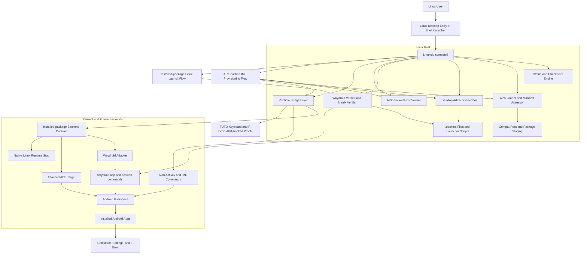
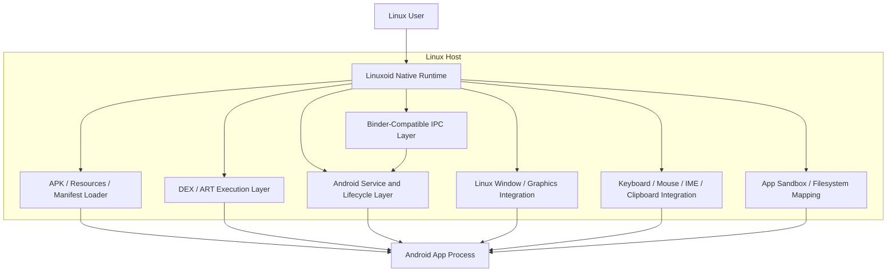

# Linuxoid

Linuxoid currently contains the first executable MVP scaffold for an Android-on-Linux compatibility project.

## Current Direction

- Core language: `C++20`
- Runtime strategy: backend-neutral attached Android targets on the path to a native Linux compatibility layer
- Current executable: `compatctl`

## Current Working Architecture



This diagram is the current working architecture and should stay in sync with the verified Linuxoid flow on GitHub.

## Target Architecture



This is the long-term goal state: run Android apps on Linux without depending on Waydroid, an emulator, or another external Android runtime.

## What Exists Today

- A C++ checkpoint engine with weighted runtime gates
- A phase-progress reporter with `0-100` loading output
- A package-layout planner for APK, app data, and OBB storage
- A decoded-manifest assessor for runtime and service requirements
- A real `load-apk` path that stages an APK into a compat root
- A generic `launch-activity` bridge for explicit Android component launches from Linux
- A generic `launch-package` bridge for installed-package launches across runtime backends, with `waydroid`, `attached-adb`, and `native` routing
- An `adb-ime-status` runtime bridge for installed IME verification on a live Android target
- A `provision-ime` runtime bridge that installs, enables, sets default, and re-verifies an IME on a live Android target
- A `desktopify-apk` path that generates a Linux wrapper script and `.desktop` entry for a caller-selected Android component, and for IME apps it generates a provisioning launcher with explicit side effects
- A `desktopify-apk-auto` path that infers the launcher activity from the APK manifest and splits desktop-entry and launcher-script roots for cleaner host integration
- A `verify-apk-host-launch-auto` path that stages a local APK, generates Linux launcher artifacts for it, and verifies the generated launcher path against a live Android runtime
- A backend-neutral installed-package launcher-artifact seam that now emits `launch-package` wrappers instead of hard-coding Waydroid in the generated host script
- A `launch-waydroid-package` compatibility alias that still launches an already installed app through the Waydroid adapter without requiring an APK reinstall or a hardcoded ADB serial
- A `desktopify-waydroid-package` path that generates a Linux launcher and `.desktop` entry for an installed Waydroid app
- A `verify-waydroid-package` path that proves direct Linux launch for an installed Waydroid app by checking the runtime launch, the generated host launcher artifacts, and the generated launcher execution
- A `verify-waydroid-matrix` path that runs the direct Linux verification loop across several installed Waydroid apps and reports pass/fail per package
- A live Waydroid-backed proof that a Linuxoid-generated launcher can install the keyboard APK, enable it, set it as default, and return `Ready for typing: yes` from Linux
- A live Waydroid-backed proof that the keyboard APK now verifies end to end from its local file path through the Linuxoid-generated launcher flow
- A live Waydroid-backed proof that the local F-Droid APK now verifies end to end from its file path through the Linuxoid-generated launcher flow
- A live Waydroid-backed proof that a Linuxoid-generated launcher can open `com.android.calculator2` from Linux through the new installed-package path
- A live Waydroid-backed mini-matrix that verifies direct Linux launch for `com.android.calculator2`, `com.android.settings`, and `org.fdroid.fdroid`
- A local test suite that verifies the first scaffold behavior

## Current External Dependencies

Linuxoid does **not** yet run Android apps natively on Linux by itself. The current project still relies on these external dependencies:

- `CMake 4.0+`
- a `C++20` compiler such as `g++` or `clang++`
- `adb` for runtime attachment, activity launch, IME control, and status checks
- `apktool` for APK decode and manifest/resource staging during `load-apk` flows
- a live Android runtime target for execution paths:
  - `Waydroid` for the currently verified installed-package Linux launch flow
  - or an attached ADB target for the generic `attached-adb` backend contract
- a Linux desktop environment that supports `.desktop` launchers and shell scripts for host integration

### Dependency Notes

- The new `launch-package` core path is backend-neutral, but **native Linux execution is still not implemented**.
- The current live proofs on GitHub are still **Waydroid-backed** for installed-package launch and matrix verification.
- `attached-adb` is now part of the core contract, but it is still a transition backend, not the final goal.

## What To Do Next

These are the next five highest-value moves if the goal is to run Android apps directly on Linux without depending on Waydroid or any other external Android runtime:

1. Build **runtime discovery and preflight** for attached targets.
   This removes hidden assumptions, makes the generic backend path honest, and prepares Linuxoid to move away from Waydroid-specific control flow.

2. Add **generic installed-package verification and matrix reporting** that no longer carries Waydroid-shaped names.
   That gives us a clean transition harness before we start replacing runtime behavior.

3. Implement a **native package launch spike** for one simple foreground app class.
   The first target should be a small app with one activity, no background services, and no IME dependence.

4. Build the first **Linuxoid-owned lifecycle and service shim**.
   The smallest meaningful slice is activity launch, process state, and a minimal Binder/service bridge for one app shape.

5. Build **native graphics, input, and window integration** for that simple app class.
   This is the point where Linuxoid starts proving real no-runtime execution instead of only better orchestration around an external Android target.

## Build

```bash
cmake -S . -B build
cmake --build build
```

## Verify

```bash
ctest --test-dir build --output-on-failure
./build/compatctl status
./build/compatctl foundation
./build/compatctl layout com.example.demo alpha01 42 /var/lib/wfa
./build/compatctl assess-manifest /path/to/decoded/AndroidManifest.xml
./build/compatctl load-apk /path/to/app.apk /tmp/wfa-load
./build/compatctl launch-activity emulator-5590 org.example.app/.SettingsActivity
./build/compatctl launch-package waydroid com.android.calculator2
./build/compatctl launch-package attached-adb 192.168.240.112:5555 com.example.demo/.MainActivity
./build/compatctl launch-package native com.example.demo
./build/compatctl verify-apk-host-launch-auto emulator-5590 /path/to/app.apk /tmp/linuxoid-apk-verify /tmp/linuxoid-apk-applications /tmp/linuxoid-apk-launchers
./build/compatctl launch-waydroid-package com.android.calculator2
./build/compatctl verify-waydroid-package com.android.calculator2 /tmp/linuxoid-applications /tmp/linuxoid-launchers
./build/compatctl verify-waydroid-matrix /tmp/linuxoid-matrix com.android.calculator2 com.android.settings org.fdroid.fdroid
./build/compatctl adb-ime-status emulator-5590 org.example.app org.example.app/.ImeService
./build/compatctl adb-ime-status emulator-5590 org.example.app org.example.app/.ImeService org.example.app/.SettingsActivity
./build/compatctl provision-ime emulator-5590 /path/to/app.apk org.example.app org.example.app/.ImeService org.example.app/.SettingsActivity
./build/compatctl desktopify-apk emulator-5590 /path/to/app.apk org.example.app/.SettingsActivity /tmp/wfa-load /tmp/wfa-desktop
./build/compatctl desktopify-apk-auto emulator-5590 /path/to/app.apk /tmp/wfa-load /tmp/linuxoid-applications /tmp/linuxoid-launchers
./build/compatctl desktopify-waydroid-package com.android.calculator2 /tmp/linuxoid-applications /tmp/linuxoid-launchers
```

## Current Progress

- Phase loading: `91/100`
- Runtime checkpoint gates: `70/100`

These values are generated by the code, not written by hand.
